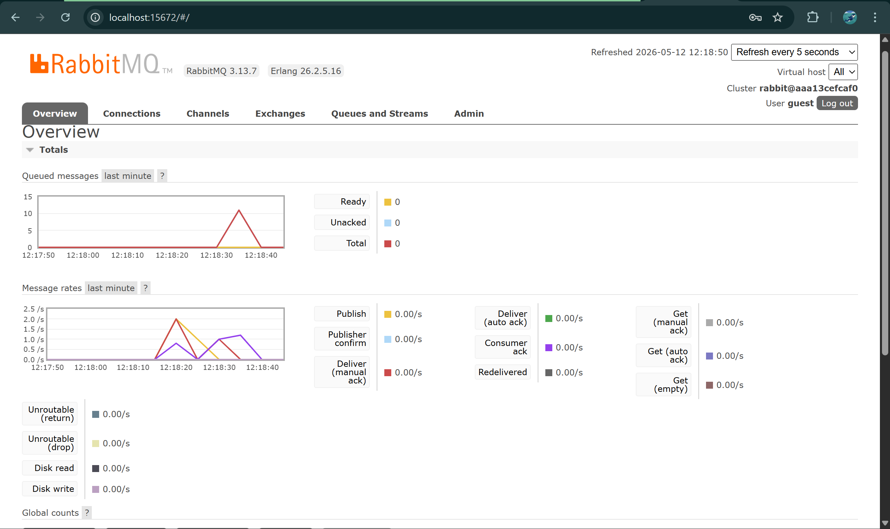
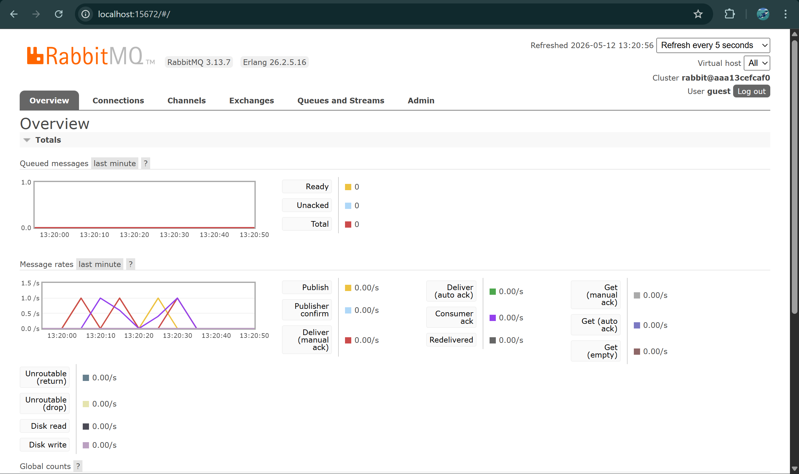

**a. What is amqp?**
AMQP adalah protokol standar terbuka di application layer untuk message-oriented middleware. Protokol ini menyediakan fitur seperti message orientation, queuing, routing, reliability, dan security.

**b. What does it mean? guest:guest@localhost:5672**
'guest' yang pertama adalah username default untuk masuk ke RabbitMQ. 'guest' yang kedua adalah password default untuk user tersebut. 'localhost:5672' adalah alamat host dan port tempat message broker RabbitMQ berjalan dan mendengarkan koneksi AMQP yang masuk.

Karena kita menambahkan jeda waktu 1 detik ('thread::sleep') pada logika pemrosesan subscriber, program tersebut hanya mampu memproses satu pesan per detik. Saat publisher mengirimkan banyak pesan secara instan, pesan-pesan yang belum tertangani akan menumpuk di dalam antrean RabbitMQ, menciptakan backlog sampai subscriber yang lambat tersebut secara bertahap memproses dan mengosongkannya satu per satu.

Reflection:
Dengan menjalankan setidaknya tiga subscriber secara bersamaan, beban kerja akan didistribusikan di antara ketiganya. Message broker RabbitMQ menggunakan mekanisme round-robin untuk membagi-bagikan pesan kepada consumer yang tersedia. Hal ini secara drastis mengurangi waktu yang dibutuhkan untuk membersihkan backlog, meskipun setiap subscriber sengaja dibuat lambat. Lonjakan pada antrean pesan menurun jauh lebih cepat karena daya pemrosesan secara efektif meningkat tiga kali lipat.
Improvement: Untuk lebih mengoptimalkan sistem ini, publisher dapat mengimplementasikan connection pooling, dan subscriber dapat menggunakan pemrosesan asynchronous yang lebih tangguh alih-alih memblokir thread utama secara manual menggunakan 'thread::sleep'.